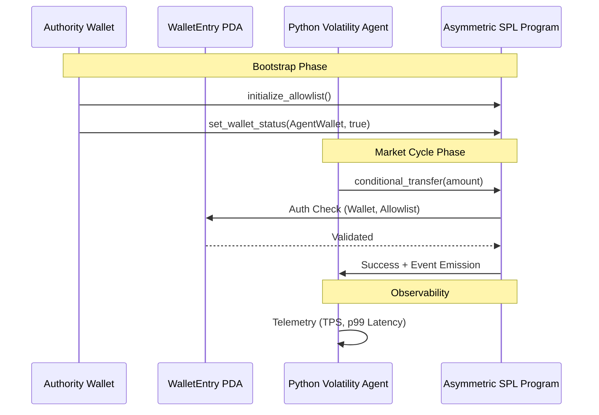

# 🦾 Solana DeFi Stress Simulator

[](https://github.com/theoxfaber/solana-defi-sim/actions/workflows/test.yml)
[](https://opensource.org/licenses/MIT)

A Solana DeFi market cycle simulation engine featuring a custom PDA-based transfer gatekeeper, asynchronous volatility agents, and live observability metrics. Designed for local stress testing and research on Solana Localnet.

> **Status**: Research / Proof-of-Concept — intended for Localnet use only.

---

## 🏗️ System Architecture

The simulator operates across three layers: **On-Chain Security**, **Orchestration**, and **Execution**.



---

## 🚀 Key Modules

### 1. The Gatekeeper (`asymmetric_spl`)
A secure Anchor program that acts as a transfer allowlist.
- **Two-Step Authority Transfer**: Secure `propose` -> `claim` rotation prevents authority lockout.
- **PDA Boundary Isolation**: Seeds validation `["wallet", allowlist, user]` prevents address spoofing.
- **Event Emission**: All state changes emit events for off-chain indexing.

### 2. The Orchestrator (`liquidity_manager`)
Deployment and configuration toolchain.
- **Config Bus**: A file-watcher (`config_watcher.js`) that allows mid-run reconfiguration (e.g., rotating RPC endpoints) without simulation downtime.
- **Wallet Injector** (`add_wallet.js`): CLI for on-chain onboarding (Airdrop -> ATA Init -> Whitelist).

### 3. The Volatility Engine (`vol_sim_agent`)
Driver of market cycle simulations with real-time feedback.
- **Observability Dashboard**: Live terminal UI (via `rich`) tracking **TPS** and **Latency Histograms** (p50, p95, p99).
- **Asynchronous Signing**: Uses `solders` to build and sign `VersionedTransactions`.

---

## 📊 Observability
The simulator provides a live terminal dashboard for real-time diagnostics:
- **TPS Counter**: Real-time throughput against the local validator.
- **Execution Health**: Per-phase success/failure ratios.
- **Latency Histograms**: p50, p95, p99 tail latency tracking.

---

## 🏁 Quick Start

### Prerequisites
- **Solana Toolchain**: `solana-cli`, `anchor-cli`
- **Environments**: Node.js 18+, Python 3.9+

### Installation & Run
1. **Initialize Localnet**:
   ```bash
   solana-test-validator --reset
   ```
2. **Bootstrap Environment**:
   ```bash
   cd liquidity_manager
   node create_env.js        # Generate fresh authority keypair
   npm install
   node deploy_pool.js
   ```
3. **Start Simulation**:
   ```bash
   cd ../vol_sim_agent
   pip3 install -r requirements.txt
   python3 main.py
   ```

---

## 🛠️ API Reference

### Rust Program Instructions

| Instruction | Accounts | Purpose |
| :--- | :--- | :--- |
| `initialize_allowlist` | `[Allowlist(W), Authority(S)]` | Global singleton initialization. |
| `set_wallet_status` | `[Entry(W), Wallet, Allowlist, Authority(S)]` | Gating a specific wallet (true/false). |
| `propose_authority` | `[Allowlist(W), Authority(S)]` | Propose a new pending authority. |
| `claim_authority` | `[Allowlist(W), PendingAuth(S)]` | Claim the primary authority role. |
| `conditional_transfer`| `[From(S), FromATA(W), ToATA(W), Allowlist, Entry]` | Validated SPL token transfer. |

---

## 🔍 Troubleshooting

### 1. `AccountNotFound` error on `add_wallet.js`
Ensure you have run `node deploy_pool.js` first. The system requires the `Allowlist` PDA to be initialized on-chain before any wallet status can be updated.

### 2. `TransactionExpired` or `BlockhashNotFound`
Localnet validators can sometimes stall. Restart the validator with the `--reset` flag:
```bash
solana-test-validator --reset
```

### 3. "Insufficient Funds" for Airdrop
Solana Localnet airdrops can be rate-limited or fail if the validator is under load. You can manually fund wallets using:
```bash
solana airdrop 10 <WALLET_ADDRESS> --url localhost
```

---

## 🛡️ Security
- All keypairs are git-ignored (`*-keypair.json`).
- `simulation_config.json` is git-ignored as it contains simulation keys.
- Run `node create_env.js` to generate a fresh authority keypair — no keys are hardcoded.
- **Localnet only**: Never use simulation keypairs with mainnet assets.

---

## 📄 License
This project is licensed under the **MIT License**.
