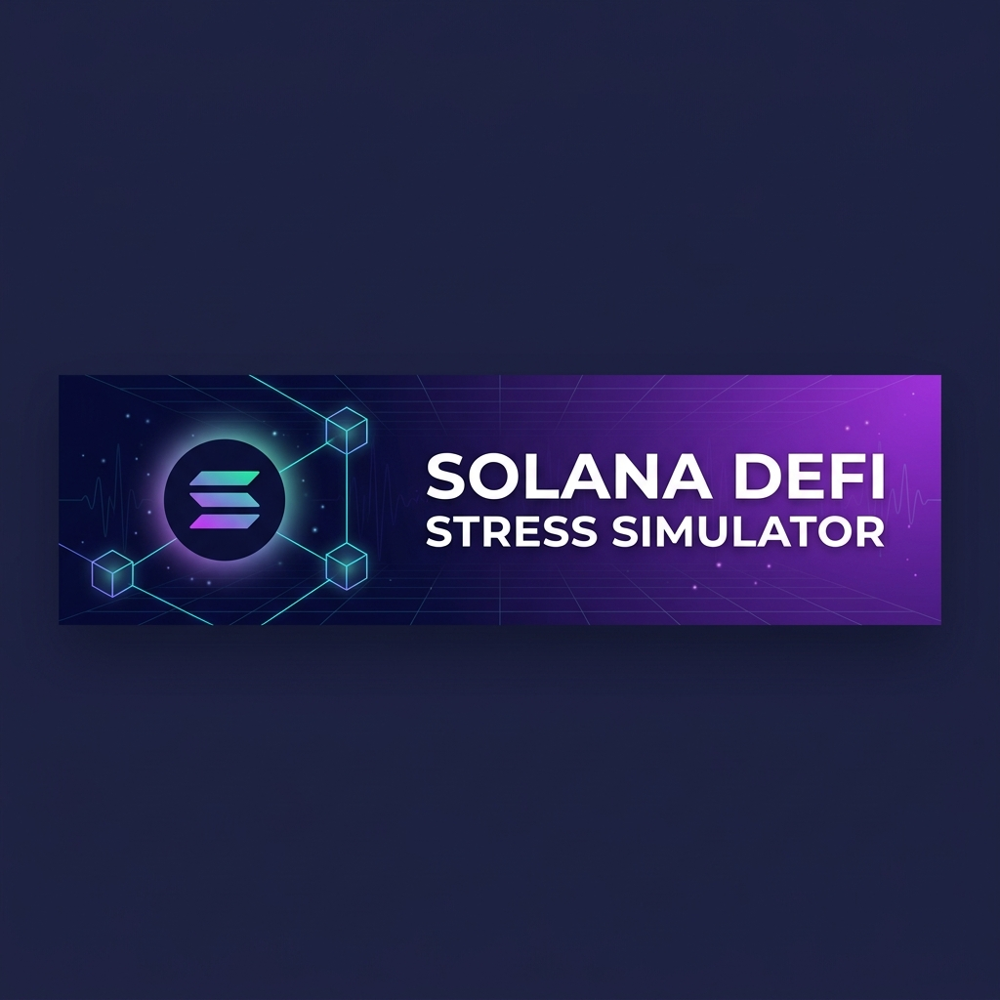
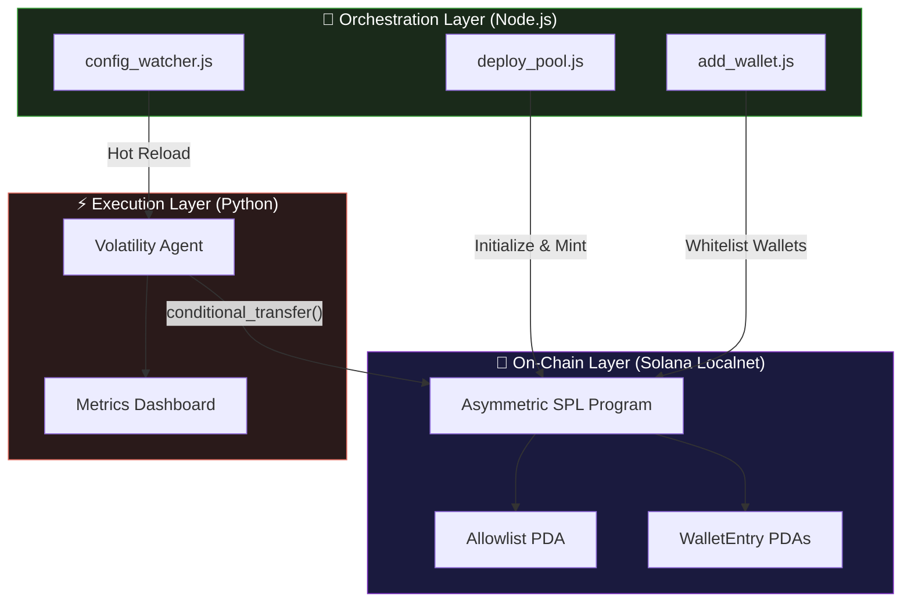

<div align="center">



<br />
<br />

**A Solana DeFi market cycle simulation engine with on-chain PDA gating,<br/>async volatility agents, and real-time observability.**

[](https://github.com/theoxfaber/solana-defi-sim/actions/workflows/test.yml)
[](https://opensource.org/licenses/MIT)
[](https://solana.com)
[](https://www.anchor-lang.com/)
[](https://python.org)
[](https://nodejs.org)

<br />

[Quick Start](#-quick-start) •
[Architecture](#-architecture) •
[Modules](#-key-modules) •
[API Reference](#-api-reference) •
[Troubleshooting](#-troubleshooting)

</div>

<br />

---

<br />

## ✨ Features at a Glance

<table>
<tr>
<td width="33%" align="center">

### 🔐 PDA Gatekeeper

On-chain Anchor program with<br/>PDA-based transfer allowlist &<br/>two-step authority rotation

</td>
<td width="33%" align="center">

### 📡 Live Dashboard

Real-time terminal UI with<br/>TPS counter, execution health,<br/>& p50/p95/p99 latency

</td>
<td width="33%" align="center">

### ♻️ Hot Config Reload

File-watcher config bus for<br/>mid-simulation RPC rotation<br/>& parameter tuning

</td>
</tr>
<tr>
<td width="33%" align="center">

### ⚡ Async Execution

`VersionedTransaction` signing<br/>via `solders` with concurrent<br/>trade submission

</td>
<td width="33%" align="center">

### 🧪 Security Fuzzing

PDA boundary tests covering<br/>seed spoofing, program ID<br/>injection, & type confusion

</td>
<td width="33%" align="center">

### 🔄 Wallet Injector

Standalone CLI for on-chain<br/>onboarding: Airdrop → ATA<br/>Init → Whitelist

</td>
</tr>
</table>

<br />

## 🏗 Architecture

The simulator is structured as three independent layers that communicate through a shared config and on-chain state:



<details>
<summary><strong>📐 Transaction Sequence Diagram</strong></summary>
<br/>


</details>

<br />

```mermaid
sequenceDiagram
    participant Auth as 🔑 Authority Wallet
    participant Prog as 📜 Asymmetric SPL
    participant PDA as 🗂️ WalletEntry PDA
    participant Agent as 🐍 Volatility Agent
    participant Dash as 📊 Dashboard

    rect rgb(26, 26, 62)
    Note over Auth, Prog: Bootstrap Phase
    Auth->>Prog: initialize_allowlist()
    Prog-->>Auth: ✓ Allowlist PDA Created
    Auth->>Prog: set_wallet_status(agent, true)
    Prog-->>PDA: ✓ WalletEntry Initialized
    end

    rect rgb(26, 42, 26)
    Note over Agent, Prog: Market Cycle Phases
    loop Accumulation → Impulse → Distribution → Capitulation → Reclamation
        Agent->>Prog: conditional_transfer(amount)
        Prog->>PDA: Verify is_allowed == true
        PDA-->>Prog: ✓ Validated
        Prog-->>Agent: Success + TransferChecked Event
        Agent->>Dash: Record latency + update TPS
    end
    end
```

## 🚀 Key Modules

### `asymmetric_spl` — The Gatekeeper

> Anchor program implementing a PDA-based transfer firewall on Solana.

| Feature | Implementation |
|:---|:---|
| **Authority Rotation** | Two-step `propose` → `claim` pattern prevents lockouts |
| **PDA Isolation** | Seeds `["wallet", allowlist, user]` enforce address authenticity |
| **Event Emission** | All state changes emit indexed events for off-chain consumption |
| **Toggle Control** | Global `is_enabled` flag allows bypassing the allowlist entirely |

<details>
<summary>📁 <strong>Program Structure</strong></summary>

```
asymmetric_spl/
├── programs/asymmetric_spl/src/
│   └── lib.rs              # Program logic, accounts, events, errors
├── tests/
│   └── asymmetric_spl.ts   # Integration + PDA boundary fuzz tests
└── Anchor.toml
```
</details>

---

### `liquidity_manager` — The Orchestrator

> Node.js toolchain for deployment, wallet management, and live configuration.

| Script | Purpose |
|:---|:---|
| `create_env.js` | Generate a fresh authority keypair for Localnet |
| `deploy_pool.js` | Create mint, generate child wallets, initialize Allowlist PDA |
| `add_wallet.js` | Inject new wallets mid-simulation (Airdrop → ATA → Whitelist) |
| `config_watcher.js` | File-watcher for hot-reloading `simulation_config.json` changes |

---

### `vol_sim_agent` — The Volatility Engine

> Async Python agent that drives five-phase market simulations with live metrics.

**Market Phases:**

```
  Accumulation ──▶ Impulse ──▶ Distribution ──▶ Capitulation ──▶ Reclamation
     (buy)         (buy)        (sell)           (sell)            (buy)
      5s            3s            5s               4s               2s
```

**Dashboard Output** (via `rich`):

```
┌──────────────────────────────────────────────────────────────────────┐
│ 🚀 SOLANA STRESS TEST │ Phase: Impulse │ Uptime: 12s │ TPS: 8     │
├──────────────────────────┬───────────────────────────────────────────┤
│  Execution Health        │  Latency Histograms                      │
│  ┌──────────────────┐    │  p50:  42.31ms                           │
│  │Phase    │  ✓ │ ✗ │    │  p95: 128.47ms                           │
│  │Accum.   │  5 │ 0 │    │  p99: 215.83ms                           │
│  │Impulse  │  7 │ 1 │    │                                          │
│  └──────────────────┘    │                                          │
└──────────────────────────┴───────────────────────────────────────────┘
```

<br />

## 🏁 Quick Start

### Prerequisites

| Tool | Version | Install |
|:---|:---|:---|
| Solana CLI | 1.18+ | [docs.solana.com](https://docs.solana.com/cli/install-solana-cli-tools) |
| Anchor CLI | 1.0+ | `cargo install --git https://github.com/coral-xyz/anchor anchor-cli` |
| Node.js | 18+ | [nodejs.org](https://nodejs.org) |
| Python | 3.9+ | [python.org](https://python.org) |

### Setup

```bash
# 1. Clone & start Localnet
git clone https://github.com/theoxfaber/solana-defi-sim.git
cd solana-defi-sim
solana-test-validator --reset

# 2. Bootstrap environment (in a new terminal)
cd liquidity_manager
node create_env.js          # Generate fresh authority keypair
npm install
node deploy_pool.js         # Create mint + allowlist + child wallets

# 3. Run the simulation (in a new terminal)
cd vol_sim_agent
pip3 install -r requirements.txt
python3 main.py             # Starts live dashboard + market cycle
```

> **Verification Mode**: Run `node deploy_pool.js --verify` or `python3 main.py --verify` to generate signed transactions without a live validator.

<br />

## 🛠 API Reference

### On-Chain Instructions

| Instruction | Accounts | Description |
|:---|:---|:---|
| `initialize_allowlist` | `Allowlist(init)`, `Authority(signer, mut)` | Create the global allowlist singleton |
| `set_wallet_status` | `WalletEntry(init_if_needed)`, `Wallet`, `Allowlist`, `Authority(signer)` | Grant or revoke transfer permission |
| `propose_authority` | `Allowlist(mut)`, `Authority(signer)` | Set a pending authority for rotation |
| `claim_authority` | `Allowlist(mut)`, `PendingAuthority(signer)` | Accept the authority role |
| `conditional_transfer` | `From(signer)`, `FromATA(mut)`, `ToATA(mut)`, `Allowlist`, `WalletEntry` | Execute a gated SPL transfer |

### PDA Derivation

```rust
// Allowlist (singleton)
seeds = [b"allowlist"]

// WalletEntry (per-user)
seeds = [b"wallet", allowlist.key().as_ref(), user.key().as_ref()]
```

### Events Emitted

| Event | Fields | When |
|:---|:---|:---|
| `AllowlistInitialized` | `authority` | Allowlist created |
| `WalletStatusUpdated` | `wallet`, `is_allowed` | Wallet whitelisted/blocked |
| `AuthorityProposed` | `current`, `pending` | New authority proposed |
| `AuthorityClaimed` | `old`, `new` | Authority rotation completed |
| `TransferChecked` | `from`, `to`, `amount`, `success` | Every transfer attempt |

<br />

## 🔍 Troubleshooting

<details>
<summary><code>AccountNotFound</code> on <code>add_wallet.js</code></summary>

Run `node deploy_pool.js` first. The Allowlist PDA must be initialized on-chain before wallets can be whitelisted.
</details>

<details>
<summary><code>TransactionExpired</code> / <code>BlockhashNotFound</code></summary>

The Localnet validator may have stalled. Restart it:
```bash
solana-test-validator --reset
```
</details>

<details>
<summary><code>Insufficient Funds</code> on airdrop</summary>

Localnet airdrops can be rate-limited. Manually fund wallets:
```bash
solana airdrop 10 <WALLET_ADDRESS> --url localhost
```
</details>

<details>
<summary>Python <code>ImportError</code> on <code>rich</code></summary>

Ensure all dependencies are installed:
```bash
pip3 install -r vol_sim_agent/requirements.txt
```
</details>

<br />

## 🛡️ Security

| Control | Implementation |
|:---|:---|
| **Key Storage** | All `*-keypair.json` and `.env` files are git-ignored |
| **Key Generation** | `create_env.js` generates fresh keypairs — no hardcoded keys |
| **Authority Rotation** | On-chain Propose → Claim prevents unauthorized access |
| **Scope** | Designed for **Localnet only** — never use with mainnet assets |

See [SECURITY.md](SECURITY.md) for the full vulnerability disclosure policy.

<br />

## 🤝 Contributing

Contributions are welcome! Please read [CONTRIBUTING.md](CONTRIBUTING.md) for guidelines on:
- Bug reporting and feature requests
- Pull request standards and branching
- Testing requirements for program changes

<br />

## 📄 License

This project is licensed under the [MIT License](LICENSE).

<br />

<div align="center">

---

<sub>Built for Solana Localnet research and stress testing.</sub>

</div>
