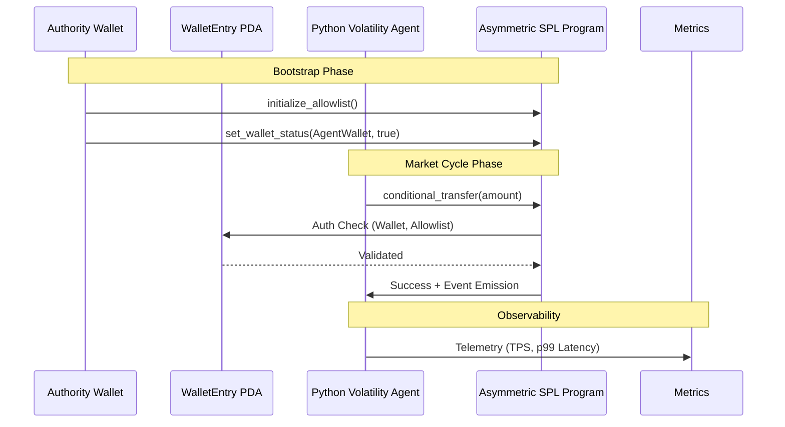

# 🦾 Solana DeFi Stress Simulator

[](https://github.com/theoxfaber/solana-defi-sim/actions/workflows/test.yml)
[](https://opensource.org/licenses/MIT)

An elite, high-fidelity execution engine for Solana DeFi market cycles. This project is engineered to move beyond "Ghost Simulations" (mocked logic) into the realm of **real-world on-chain execution**, featuring a custom PDA gatekeeper, asynchronous volatility agents, and live observability metrics.

---

## 🏗️ System Architecture

The simulator operates across three specialized layers: **On-Chain Security**, **Orchestration**, and **High-Throughput Execution**.



---

## 🚀 Key Modules

### 1. The Gatekeeper (`asymmetric_spl`)
A secure Anchor program that acts as a liquidity firewall.
- **Two-Step Authority Transfer**: Secure `propose` -> `claim` rotation prevents authority lockout.
- **PDA Boundary Isolation**: Mathematical seeds validation `["wallet", allowlist, user]` prevents address spoofing.
- **Event-First Emission**: Optimized for off-chain indexing and high-throughput monitoring.

### 2. The Orchestrator (`liquidity_manager`)
Production-grade deployment and hot-reloading toolchain.
- **Resilient Config Bus**: A file-watcher implementation that allows mid-run reconfiguration (e.g., rotating RPC endpoints or authority keys) without simulation downtime.
- **Phase 2 Wallet Injector**: Standalone CLI for on-chain onboarding (Airdrop -> ATA Init -> Whitelist) to scale load dynamically.

### 3. The Volatility Engine (`vol_sim_agent`)
Driver of high-frequency market cycles with real-time feedback.
- **Observability Dashboard**: Live terminal UI tracking **TPS** and **Tail Latency Histograms** (p50, p95, p99).
- **Asynchronous Signing**: Uses `solders` to build and sign `VersionedTransactions` with minimal overhead.

---

## 📊 Observability
The simulator provides a live terminal dashboard for real-time diagnostics:
- **TPS Counter**: Real-time throughput against the local validator.
- **Execution Health**: Per-phase success/failure ratios.
- **Latency Histograms**: Critical metrics for engineering high-performance trading systems.

---

## 🏁 Quick Start

### Prerequisites
- **Solana Toolchain**: `solana-cli`, `anchor-cli`
- **Environments**: Node.js 18+, Python 3.9+

### Installation & Run
1. **Initialize Localnet**:
   ```bash
   solana-test-validator --reset
   ```
2. **Bootstrap Environment**:
   ```bash
   cd liquidity_manager && npm install
   node deploy_pool.js
   ```
3. **Start Simulation**:
   ```bash
   cd ../vol_sim_agent && pip3 install -r requirements.txt
   python3 main.py
   ```

## 🛡️ Security
This project implements **Local-Only Private Key Storage**.
- All keypairs are git-ignored (`*-keypair.json`).
- `simulation_config.json` is git-ignored as it contains active simulation keys.
- **Zero-Exposure Policy**: No private keys are ever committed to the repository.

---

## 📄 License
This project is licensed under the **MIT License**.
