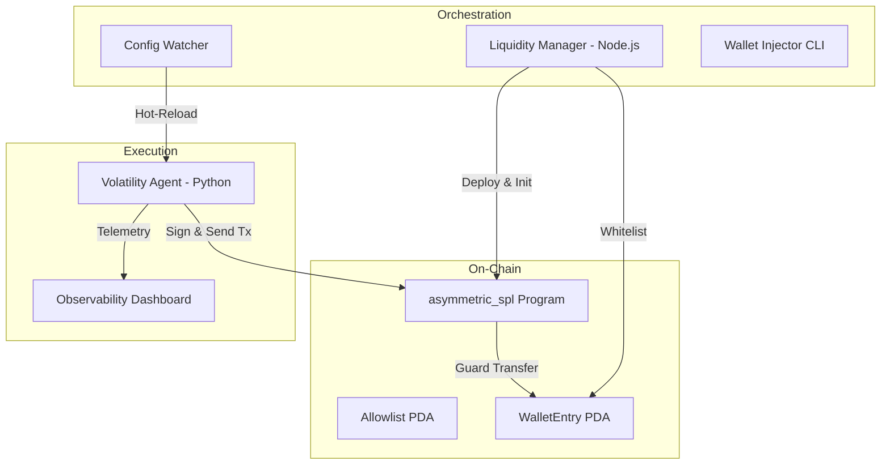

# Solana DeFi Stress Simulator

A high-fidelity, production-ready execution engine for Solana DeFi market cycles. This project enables developers and quantitative analysts to simulate complex market phases (Accumulation, Impulse, Distribution, Capitulation) using **real, signed, on-chain transactions** on a local validator or devnet.

## 🚀 Key Features

-   **Gatekeeper Smart Contract (Anchor/Rust)**: Implements a secure PDO-based allowlist for token transfers. Features a secure two-step authority rotation pattern.
-   **High-Throughput Simulation (Python/Solders)**: Asynchronous trading agent that drives volume through signed `VersionedTransactions`.
-   **Live Observability Dashboard**: Real-time terminal UI tracking TPS, Success/Failure rates, and Latency Histograms (p50, p95, p99).
-   **Resilient Config Bus (Node.js)**: Mid-run hot-reloading of RPC endpoints and market parameters without simulation restart.
-   **Security Hardened**: Comprehensive Anchor test suite including PDA boundary fuzzing and security challenge tests.

---

## 🏗️ Architecture



---

## 🛠️ Modules

### 1. On-Chain Gatekeeper (`asymmetric_spl`)
The primary on-chain security layer. It gates SPL Token transfers via a custom `conditional_transfer` instruction.
- **Two-Step Rotation**: Propose and Claim pattern for authority handover.
- **Strict PDA Gating**: Validates that the sender is whitelisted in a program-derived address.

### 2. Liquidity Manager (`liquidity_manager`)
Automates the bootstrapping of the DeFi environment.
- **`deploy_pool.js`**: Mints tokens, funds pools, and initializes the allowlist.
- **`add_wallet.js`**: CLI for dynamic Phase 2 wallet injection (Airdrop -> ATA -> Whitelist).
- **`config_watcher.js`**: Monitors `simulation_config.json` for live updates.

### 3. Volatility Agent (`vol_sim_agent`)
The "Driver" for the stress test. Replicates 5-phase market cycles with high-throughput signed execution.
- **Dashboard**: Powered by `rich`, providing live p99 latency tracking.
- **Async Engine**: Uses `asyncio` for simultaneous trade execution.

---

## 🏁 Quick Start

### 1. Requirements
- Rust / Anchor
- Node.js
- Python 3.9+
- Solana CLI

### 2. Setup Localnet
```bash
solana-test-validator --reset
```

### 3. Bootstrap Environment
```bash
cd liquidity_manager
npm install
node deploy_pool.js
```

### 4. Run Simulation
```bash
cd vol_sim_agent
pip3 install -r requirements.txt
python3 main.py
```

## 🛡️ Security
This project is for research and stress-testing purposes. Private keys generated during deployment are stored in `simulation_config.json` (git-ignored). Always use a dedicated development wallet for simulation.

---

## 📄 License
This project is provided under the **MIT License**.
